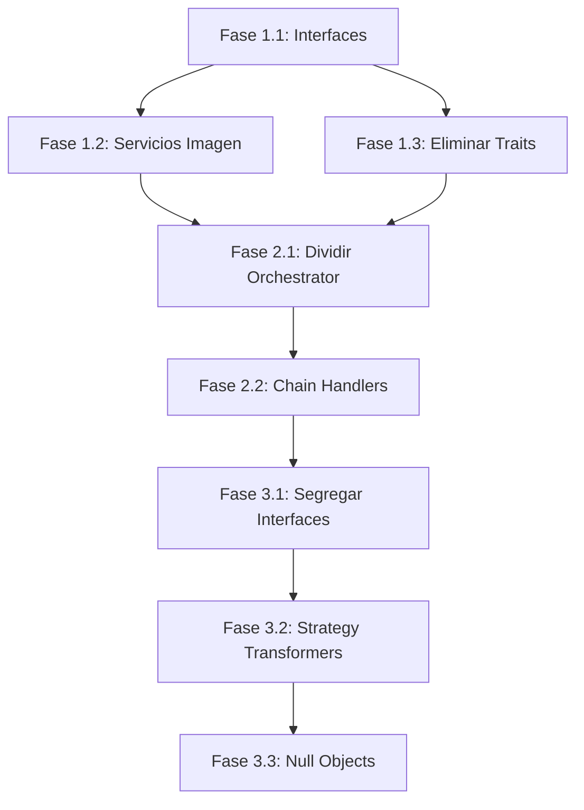

# Plan de Refactorización SOLID - SNAAPI

**Fecha**: 2026-02-03
**Versión**: 1.0.0
**Estado**: En Planificación

---

## Resumen Ejecutivo

Se han identificado **35+ violaciones de principios SOLID** en el proyecto snaapi, distribuidas en 5 capas principales. El refactoring se organizará en 3 fases con prioridades claras.

---

## Inventario de Violaciones por Capa

### 1. Capa Application (DataTransformers)

| Archivo | Principio | Severidad | Descripción |
|---------|-----------|-----------|-------------|
| `DetailsAppsDataTransformer.php` | SRP | 🔴 Alta | 6+ responsabilidades mezcladas |
| `DetailsMultimediaPhotoDataTransformer.php` | SRP | 🔴 Alta | 350 líneas, múltiples responsabilidades |
| `BodyTagInsertedNewsDataTransformer.php` | SRP | 🟡 Media | 4 responsabilidades |
| `RecommendedEditorialsDataTransformer.php` | SRP | 🟡 Media | 4 responsabilidades |
| `JournalistsDataTransformer.php` | SRP | 🟡 Media | 5 responsabilidades |
| `DetailsMultimediaDataTransformer.php` | SRP | 🟡 Media | Múltiples responsabilidades |
| `BodyElementDataTransformerHandler.php` | OCP | 🟡 Media | Estrategia hardcodeada |
| `MediaDataTransformerHandler.php` | OCP | 🟡 Media | Resolución acoplada |
| `DetailWidgetDataTransformerHandler.php` | OCP | 🟡 Media | Acoplamiento a búsqueda |
| `HtmlWidgetDataTransformer.php` | LSP | 🟡 Media | Retorna array vacío violando contrato |
| `BodyElementDataTransformer.php` | ISP | 🟡 Media | Interfaz con 3 métodos innecesarios |
| `MediaDataTransformer.php` | ISP | 🟡 Media | Interfaz no segregada |
| `WidgetTypeDataTransformer.php` | ISP | 🟡 Media | Métodos forzados |
| Múltiples transformadores | DIP | 🟡 Media | Dependencia directa de `Thumbor` |

### 2. Capa Controller

| Archivo | Principio | Severidad | Descripción |
|---------|-----------|-----------|-------------|
| `EditorialController.php` | ✅ OK | - | Cumple SOLID |
| `Schemas/*` (17 archivos) | ✅ OK | - | Cumplen SOLID |

### 3. Capa Orchestrator

| Archivo | Principio | Severidad | Descripción |
|---------|-----------|-----------|-------------|
| `EditorialOrchestrator.php` | SRP | 🔴 Crítica | 536 líneas, 20 dependencias, 8+ responsabilidades |
| `EditorialOrchestrator.php` | OCP | 🔴 Alta | Procesamiento hardcodeado para tipos |
| `EditorialOrchestrator.php` | DIP | 🔴 Alta | 18 clases concretas inyectadas |
| `OrchestratorChainHandler.php` | OCP | 🟡 Media | Código duplicado con MultimediaHandler |
| `MultimediaOrchestratorHandler.php` | OCP | 🟡 Media | Lógica idéntica duplicada |
| `EditorialOrchestratorInterface.php` | ISP | 🟡 Media | `canOrchestrate()` no pertenece |
| `MultimediaOrchestratorInterface.php` | ISP | 🟡 Media | Mismo problema |
| `MultimediaTrait.php` | SRP/DIP | 🟡 Media | Trait con múltiples responsabilidades |

### 4. Capa Infrastructure

| Archivo | Principio | Severidad | Descripción |
|---------|-----------|-----------|-------------|
| `Thumbor.php` | SRP | 🔴 Alta | Path building + filtros + extensiones |
| `PictureShots.php` | SRP | 🔴 Alta | Data + Logic mixing, 176 líneas |
| `MultimediaTrait.php` | ISP | 🟡 Media | 4 responsabilidades en 1 trait |
| `SitesEnum.php` | OCP | 🟡 Media | Requiere modificación para extensión |
| `ClossingModeEnum.php` | OCP | 🟡 Media | Match statement no extensible |
| `EditorialTypesEnum.php` | OCP | 🟡 Media | IDs hardcodeados |
| `QueryLegacyClient.php` | DIP | 🟡 Media | Sin interfaz definida |
| `UrlGeneratorTrait.php` | ISP | 🟡 Media | Estado + lógica + acoplamiento |
| Compiler Passes (5 archivos) | DRY | 🟡 Media | Código 95% idéntico |

### 5. EventSubscribers y Handlers

| Archivo | Principio | Severidad | Descripción |
|---------|-----------|-----------|-------------|
| `ExceptionSubscriber.php` | SRP | 🟡 Media | 4 responsabilidades |
| `ExceptionSubscriber.php` | DIP | 🟡 Media | Depende de primitivo `$appEnv` |
| `CacheControl.php` | SRP | 🟡 Media | 5 operaciones en 1 método |
| `CacheControl.php` | DIP | 🟡 Media | `new DateTimeImmutable()` directo |
| `PurgeEditorialHandler.php` | SRP | 🔴 Alta | 4 responsabilidades distintas |
| `PurgeEditorialHandler.php` | OCP | 🟡 Media | Comandos hardcodeados |
| `PurgeEditorialHandler.php` | DIP | 🟡 Media | `new AmqpStamp()` directo |
| `Kernel.php` | SRP | 🟡 Media | Registro directo de passes |

---

## Patrones de Diseño a Aplicar

### Patrones Estructurales

| Patrón | Aplicación | Archivos Afectados |
|--------|------------|-------------------|
| **Facade** | Agrupar clientes de datos | `EditorialOrchestrator` |
| **Composite** | Agrupar transformadores | `DataTransformers/*` |
| **Decorator** | Añadir funcionalidad a transformadores | `BodyElementDataTransformer` |
| **Adapter** | Interfaz para `Thumbor` | `Infrastructure/Service/*` |

### Patrones de Comportamiento

| Patrón | Aplicación | Archivos Afectados |
|--------|------------|-------------------|
| **Strategy** | Separar lógica de transformación | `DetailsAppsDataTransformer`, `PictureShots` |
| **Chain of Responsibility** | Procesamiento de editoriales relacionadas | `EditorialOrchestrator` |
| **Template Method** | Compiler passes genéricos | `DependencyInjection/Compiler/*` |
| **Null Object** | Widgets sin datos | `HtmlWidgetDataTransformer` |

### Patrones Creacionales

| Patrón | Aplicación | Archivos Afectados |
|--------|------------|-------------------|
| **Factory** | Crear comandos de purga | `PurgeEditorialHandler` |
| **Builder** | Construir respuestas de cache | `CacheControl`, `ExceptionSubscriber` |
| **Registry** | Configuración de sitios | `SitesEnum`, `ClossingModeEnum` |

---

## Plan de Ejecución por Fases

### Fase 1: Infraestructura Base (Prioridad Crítica)

#### 1.1 Crear Interfaces para Servicios Core

```
Tareas:
├── [ ] Crear ImageProcessorInterface (abstrae Thumbor)
├── [ ] Crear ImageSizeConfigurationInterface
├── [ ] Crear SiteRegistryInterface (reemplaza SitesEnum estático)
├── [ ] Crear LegacyEditorialClientInterface
├── [ ] Crear EnvironmentCheckerInterface
└── [ ] Crear ClockInterface
```

#### 1.2 Refactorizar Servicios de Imagen

```
Tareas:
├── [ ] Extraer ImagePathBuilder de Thumbor
├── [ ] Extraer ImageFilterApplier de Thumbor
├── [ ] Crear ThumborUrlFactory como coordinador
├── [ ] Extraer ImageSizeConfiguration de PictureShots
├── [ ] Extraer AspectRatioMapper de PictureShots
└── [ ] Crear BodyTagPhotoProcessor
```

#### 1.3 Eliminar Traits Problemáticos

```
Tareas:
├── [ ] Convertir MultimediaTrait a composición
├── [ ] Convertir UrlGeneratorTrait a servicio
├── [ ] Convertir CacheControl trait a servicio
└── [ ] Actualizar clases que usaban traits
```

### Fase 2: Capa de Orquestación (Prioridad Alta)

#### 2.1 Dividir EditorialOrchestrator

```
Tareas:
├── [ ] Crear InsertedNewsProcessor
├── [ ] Crear RecommendedEditorialsProcessor
├── [ ] Crear MultimediaProcessor
├── [ ] Crear MembershipLinksProcessor
├── [ ] Crear BodyTagPhotoExtractor
├── [ ] Crear SignatureTransformer
├── [ ] Crear EditorialDataFacade (agrupa clientes)
├── [ ] Crear EditorialTransformerComposite
└── [ ] Refactorizar EditorialOrchestrator para usar nuevos componentes
```

#### 2.2 Unificar Chain Handlers

```
Tareas:
├── [ ] Crear GenericChainHandler abstracto
├── [ ] Segregar OrchestratorTypeIdentifierInterface
├── [ ] Refactorizar OrchestratorChainHandler
├── [ ] Refactorizar MultimediaOrchestratorHandler
└── [ ] Actualizar Compiler Passes para usar Template Method
```

### Fase 3: Capa de Aplicación (Prioridad Media)

#### 3.1 Segregar Interfaces de DataTransformers

```
Tareas:
├── [ ] Crear BodyElementTransformerInterface (solo transform)
├── [ ] Crear TransformerRegistryInterface (solo registro)
├── [ ] Crear MediaTransformerInterface segregada
├── [ ] Crear WidgetTransformerInterface segregada
└── [ ] Actualizar implementaciones
```

#### 3.2 Aplicar Strategy a Transformadores Complejos

```
Tareas:
├── [ ] Crear SectionTransformer (extraído de DetailsAppsDataTransformer)
├── [ ] Crear TagTransformer (extraído de DetailsAppsDataTransformer)
├── [ ] Crear HierarchyTransformer (extraído de DetailsAppsDataTransformer)
├── [ ] Crear JournalistUrlGenerator
├── [ ] Crear PhotoUrlGenerator
└── [ ] Crear TwitterFormatter
```

#### 3.3 Crear Null Objects

```
Tareas:
├── [ ] Crear NullWidgetDataTransformer
└── [ ] Actualizar HtmlWidgetDataTransformer para lanzar excepción o delegar
```

---

## Criterios de Éxito

### Tests

- [ ] Todos los tests existentes pasan (`make test`)
- [ ] Cobertura de tests ≥ 80% en código nuevo
- [ ] Tests unitarios para cada nueva interfaz/clase

### Análisis Estático

- [ ] PHPStan nivel 8 sin errores (`make phpstan`)
- [ ] PHP-CS-Fixer sin cambios pendientes

### Métricas SOLID

| Métrica | Actual | Objetivo |
|---------|--------|----------|
| Líneas por clase (max) | 536 | ≤ 200 |
| Dependencias por clase (max) | 20 | ≤ 5 |
| Métodos por interfaz (max) | 3+ | ≤ 5 |
| Violaciones DIP | 15+ | 0 |
| Score SOLID Review | ~10/25 | ≥ 18/25 |

### Compatibilidad

- [ ] API pública sin cambios (contratos mantenidos)
- [ ] Configuración de servicios actualizada
- [ ] Sin breaking changes para consumidores

---

## Dependencias del Refactoring



---

## Notas de Implementación

### Estrategia de Migración

1. **Crear primero, migrar después**: Crear nuevas clases sin eliminar las antiguas
2. **Alias de servicios**: Usar alias para mantener compatibilidad durante transición
3. **Feature flags**: Considerar flags para cambiar entre implementaciones
4. **Tests primero**: Escribir tests antes de cada refactoring

### Riesgos Identificados

| Riesgo | Mitigación |
|--------|------------|
| Romper API | Tests de contrato antes de cambios |
| Performance | Benchmarks antes/después |
| Regresiones | CI/CD con tests completos |
| Complejidad temporal | Documentar estado intermedio |

---

## Próximos Pasos

1. ✅ Análisis completado
2. ⏳ Aprobar plan de refactorización
3. ⏳ Crear branch de feature
4. ⏳ Iniciar Fase 1.1 (Interfaces)
5. ⏳ Review y merge incremental
